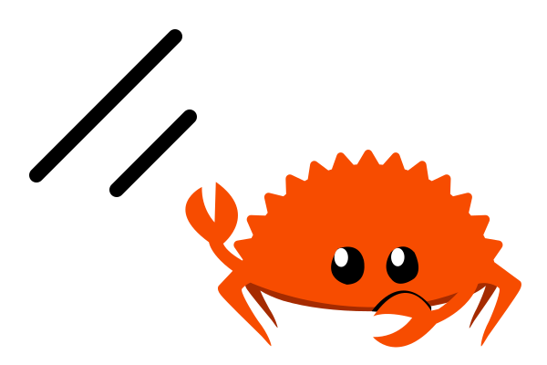

    

<h1 align="center">shadcn-ui-yew-avatar</h1>

An image element with a fallback for representing the user.

[Rust shadcn/ui](https://github.com/RustForWeb/shadcn-ui) is a Rust port of [shadcn/ui](https://ui.shadcn.com/).

## Documentation

See [the Rust shadcn/ui book](https://shadcn-ui.rustforweb.org/) for documentation.

## Rust for Web

The Rust shadcn/ui project is part of [Rust for Web](https://github.com/RustForWeb).

[Rust for Web](https://github.com/RustForWeb) creates and ports web libraries for Rust. All projects are free and open source.
